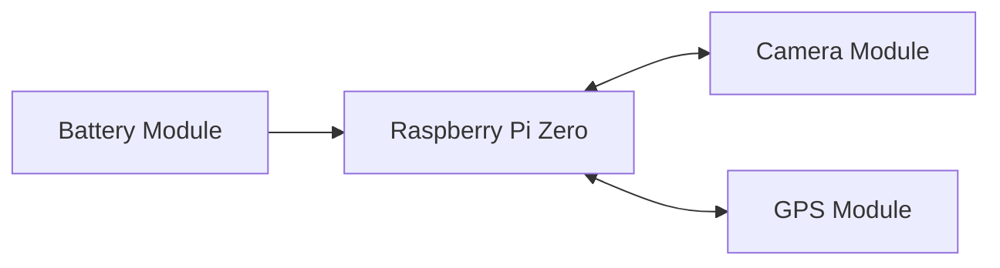

# Open Source Raspberry Pi Based Data Collection
This is an open-source project for Data Collection based on low-cost Raspberry Pi single-board computers, low-cost sensor modules, 3D-printed housings, and Python code to generate human-readable data in the form of Excel (.xls) or Comma-Separated Values (.csv) files.

## Goal
Python-based code for collecting data on Raspberry Pi Zero 2 W from external sensors and writing it to an internal microSD card as an Excel file. 
The code can be run through a simple terminal command outlined below.

This device can be used as a modular biometric and environmental data collection device or as a standalone data collection device.

The goal of this project is on making the entire process as user-friendly and accessible as possible.

## Navigation

For first time setup: [Directions for First Time Setup](#directions-for-first-time-setup)

For information on Modules: [Sensors and Modules](#sensors-and-modules)

For 3D printable enclosures: [3D Files](./3D%20Files/) or in a collection on [Printables.com](https://www.printables.com/@HenryLevesque/collections/1649941)

## Python File Explanation and Directions
File organization and Directions for how to use specific configurations.

### To Collect Camera and GPS Data
Run [collect_camera_gps.py](collect_camera_gps.py) to run the gps module and camera module data collection sequence
### Hardware Configuration


### Directions

1. Navigate to the directory
    ```
    cd rpi_data_collection
    ```
2. Run the Python file
    ```
    python3 collect_camera_gps.py

- camera_only.py
    - runs the camera module data collection sequence without gps data
- fake_gps.py
    - runs the gps and camera module data collection sequence with filler data for the gps

## Sensors and Modules

### Supported Sensors and Modules
- GPS Module: Provides geotagging data for mapping in GIS applications.
- Camera Module: Collects environmental data and facial data for later use with computer vision analysis.
- Battery Module: PiSugar battery that enables wireless operation of the data collection device.

### Future Sensors and Modules
- Microphone Module: Measures environmental noise levels for noise pollution data collection.
- Thermometer Module: Measures environmental heat levels for heat island data collection.
- Heartrate Sensor: Measures heart rate to detect stress for biometric data collection.

## Directions for First Time Setup

To add code to a Raspberry Pi Zero 2 W and run it headlessly, follow these steps:

1. Connect to the Raspberry Pi Zero 2 W via SSH. Use a tool like PuTTY (Windows) or Terminal (Mac/Linux) to establish an SSH connection. Ensure that the Raspberry Pi is connected to the same network as your computer.

2. Once connected, navigate to the desired directory to add your code. For example, you can use the following command to navigate to the home directory:
    ```
    cd ~
    ```

3. Clone the repository using the following command:
    ```
    git clone https://github.com/hleve/rpi_data_collection.git


4. After the cloning process is complete, navigate into the cloned repository directory:
    ```
    cd rpi_data_collection
    ```

6. Install Requirements and Pandas (might require a virtual environment or venv)
    ```
    python3 -m venv .venv source .venv/bin/activate python3 -m pip install -r requirements.txt cd rpi_data_collection
  
    sudo apt-get install python3-pandas
    ```
    
9. If you receive the following error while trying to install pandas: dpkg was interrupted, you must manually run sudo dpkg --configure -a to correct the problem.n error when trying to install pandas, run the following code as suggested:
    ```
    sudo dpkg --configure -a
    ```
10. Install requirements.txt
    ```
    sudo apt-get install requirements.txt
    ```
    
### To run from terminal or SSH

1. Navigate to the directory
    ```
    cd rpi_data_collection
    ```
2. Run the Python file
    ```
    python3 collect_camera_gps.py
    ```

## License
This project is licensed under the [Apache 2.0 License](https://www.apache.org/licenses/LICENSE-2.0)

